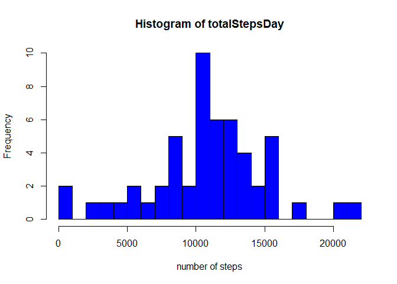
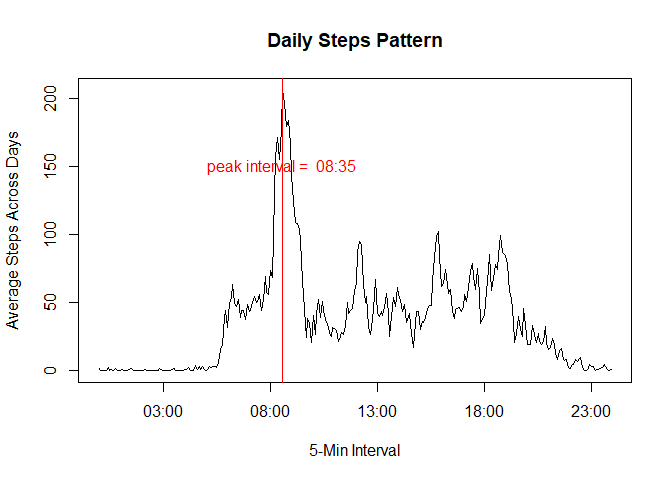
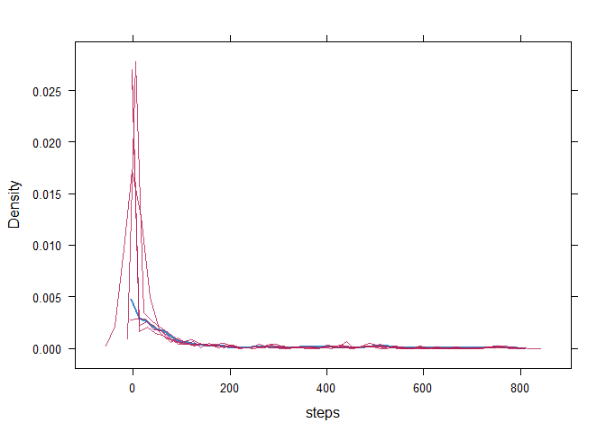
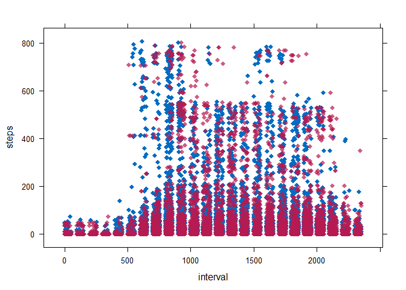
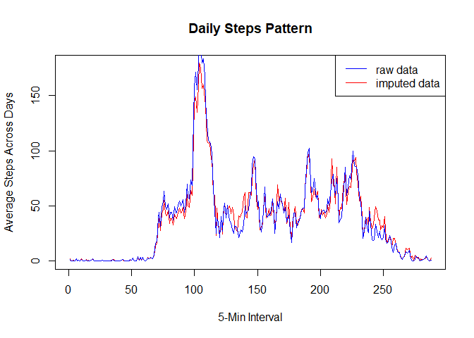
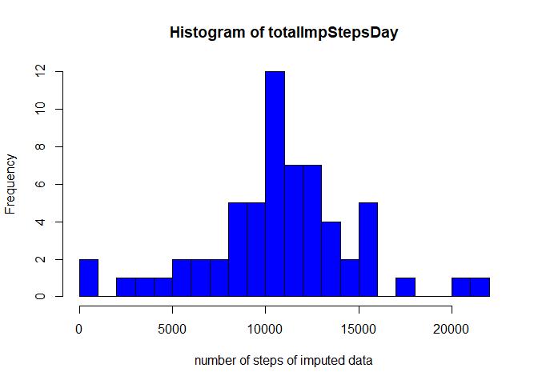
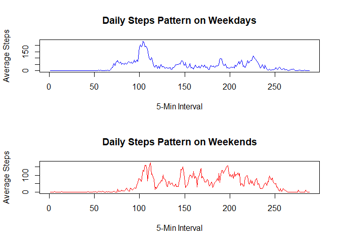

## Loading and preprocessing the data

```r
# read data from "activity.csv"
rawData <- read.csv("activity.csv")


# change date format to date from factor
rawData$date <- as.Date(rawData$date, "%Y-%m-%d",stringAsFactors = FALSE)

# change interval time format to "00:00"
tempTime <- as.character(rawData$interval)
zeroChar <- mapply(function(x,y) {
        paste0(rep(x,y), collapse = "")}, 
        0, (4-nchar(tempTime))
        )
tempTimeChar <- paste0(zeroChar, tempTime)
tempTimeChar <- format(strptime(tempTimeChar, format="%H%M"), format = "%H:%M")

# add date and time variable
tempTime <- paste(as.character(rawData$date), tempTimeChar)
rawData$time <- as.POSIXct(tempTime, format="%Y-%m-%d %H:%M")
```


## What is mean total number of steps taken per day?

```r
# total number of steps per day
totalStepsDay <- tapply(rawData$steps, rawData$date, sum)

# Mean and Median of the total number of steps per day
meanTotalStepsDay <- mean(totalStepsDay, na.rm = TRUE)
medianTotalStepDay <- median(totalStepsDay, na.rm=TRUE)

# Plot a histogram of total number of steps per day
hist(totalStepsDay, breaks = 30, xlab = "number of steps", col = "blue")
```

<!-- -->
The mean and median of the total number of steps taken per day are 1.0766189\times 10^{4} and 10765 respectively.


## What is the average daily activity pattern?

```r
# average across all days per the 5-minute interval
meanStepsPerInterval <- tapply(rawData$steps, format(rawData$time, format ="%H:%M"), mean, na.rm=TRUE )

AvgPerInterval <- data.frame(AvgStepsInterval= meanStepsPerInterval, Interval=strptime(names(meanStepsPerInterval),"%H:%M"), row.names = NULL, stringsAsFactors = FALSE )

peakInterval <- AvgPerInterval$Interval[which.max(AvgPerInterval$AvgStepsInterval)]
peakIntervalChar <- format(peakInterval, format = "%H:%M")

# Ploting the 5-minute interval (x-axis) and the average number of steps taken, average across all days(y-axis)
plot(AvgPerInterval$Interval, AvgPerInterval$AvgStepsInterval, xlab= "5-Min Interval", ylab = "Average Steps Across Days", type = "l", main="Daily Steps Pattern" )

abline(v=peakInterval, lty=1, lwd=1, col="red")

text(peakInterval, 150, labels = paste("peak interval = ",peakIntervalChar), col="red")
```

<!-- -->

```r
# average steps per day
meanStepsDay <- tapply(rawData$steps, rawData$date, mean)
```

The steps incrase from around 6am eand decline from 6pm. The number of steps stays zero from 11pm to 5am. 

The period with the highest average steps across the days is 08:35.  


## Imputing missing values

```
## Loading required package: mice
```

```
## Loading required package: Rcpp
```

```
## Warning: package 'Rcpp' was built under R version 3.3.3
```

```
## mice 2.25 2015-11-09
```
Check the NA pattern in the raw data.

```r
colSums(is.na(rawData))/nrow(rawData)
```

```
##     steps      date  interval      time 
## 0.1311475 0.0000000 0.0000000 0.0000000
```
13% of steps are missing, and no missing in date and interval. 


Impute missing values of steps the mice package using predictive mean matching (PMM) mathod.

```r
tempdata <- rawData[c(1,3)]
imputTempData <- mice(tempdata, m=5, method = "pmm") 
```

```
## 
##  iter imp variable
##   1   1  steps
##   1   2  steps
##   1   3  steps
##   1   4  steps
##   1   5  steps
##   2   1  steps
##   2   2  steps
##   2   3  steps
##   2   4  steps
##   2   5  steps
##   3   1  steps
##   3   2  steps
##   3   3  steps
##   3   4  steps
##   3   5  steps
##   4   1  steps
##   4   2  steps
##   4   3  steps
##   4   4  steps
##   4   5  steps
##   5   1  steps
##   5   2  steps
##   5   3  steps
##   5   4  steps
##   5   5  steps
```

```r
densityplot(imputTempData)
```

<!-- -->

```r
xyplot(imputTempData, steps ~ interval,pch=18,cex=1)
```

<!-- -->

```r
modelFit1 <- with(imputTempData,lm(steps ~ interval))
summary(pool(modelFit1))
```

```
##                      est        se         t       df     Pr(>|t|)
## (Intercept) 28.529947343 2.1736652 13.125272 22.95663 3.723688e-12
## interval     0.007430789 0.0016657  4.461062 18.23465 2.932838e-04
##                   lo 95       hi 95 nmis       fmi    lambda
## (Intercept) 24.03290831 33.02698637   NA 0.4618790 0.4169544
## interval     0.00393451  0.01092707    0 0.5180202 0.4679044
```

```r
imputeData <- complete(imputTempData, 2)
```

Compare average steps per interval betwen imputed and raw data.

```r
AvgImputeData <- tapply(imputeData$steps, imputeData$interval, mean)
plot(AvgImputeData, xlab= "5-Min Interval", ylab = "Average Steps Across Days", type = "l", main="Daily Steps Pattern", col="red" )
lines(AvgPerInterval$AvgStepsInterval, col="blue", ylab="n", ylab="n")
legend("topright", legend = c("raw data", "imputed data"), col = c("blue", "red"), lty=1)
```

<!-- -->

```r
# add the imputed data into the raw data set
rawData$impSteps <- imputeData$steps

# total number of steps per day
totalImpStepsDay <- tapply(rawData$impSteps, rawData$date, sum)

# Plot a histogram of total number of steps per day
hist(totalImpStepsDay, breaks = 30, xlab = "number of steps of imputed data", col = "blue")
```

<!-- -->


## Are there differences in activity patterns between weekdays and weekends?

```r
wkends <- c("Saturday", "Sunday")
rawData$weekday <- factor(weekdays(rawData$date, abbreviate = FALSE) %in% wkends, levels=c(TRUE, FALSE), labels = c("weekend", "weekday"))

weekdayAVG <- tapply(rawData$steps[rawData$weekday=="weekday"], format(rawData$time[rawData$weekday=="weekday"], format ="%H:%M"), mean, na.rm=TRUE )
weekendAVG <- tapply(rawData$steps[rawData$weekday=="weekend"], format(rawData$time[rawData$weekday=="weekend"], format ="%H:%M"), mean, na.rm=TRUE )

par(mfrow=c(2,1) )
plot(weekdayAVG, xlab= "5-Min Interval", ylab = "Average Steps", type = "l", main="Daily Steps Pattern on Weekdays", col="blue" )
plot(weekendAVG, xlab= "5-Min Interval", ylab = "Average Steps", type = "l", main="Daily Steps Pattern on Weekends", col="red" )
```

<!-- -->

The patterns show that there are more steps on hearly morning on weekday, and more steps on most day time on weekend. 
